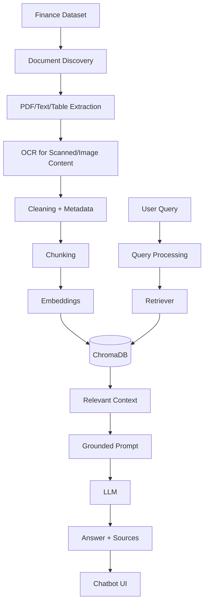

# Finance RAG Chatbot

## Problem

The task is to build a grounded finance question-answering assistant over the organizer-supplied dataset for the AI ODYSSEY Finance theme. The application must retrieve evidence from the provided documents instead of relying on general model knowledge.

## Solution

This project provides a simple, beginner-friendly RAG pipeline using Python, FastAPI, ChromaDB, LangChain text splitters, and an Ollama-backed local LLM if available.

## Architecture



## RAG Pipeline

1. Discover files in the configured dataset directory.
2. Extract text from PDFs, TXT, DOCX, CSV, XLSX, and image files.
3. Normalize and preserve metadata.
4. Chunk content with overlap.
5. Embed chunks using a local model.
6. Store vectors in ChromaDB.
7. Retrieve relevant chunks for a query.
8. Pass the top chunks into a grounded prompt.
9. Generate an answer and attach citation sources.

## OCR Pipeline

PDF and image pages that have little text or are image-heavy can be processed with OCR using Tesseract when available. The system tries standard PDF extraction first and falls back to OCR when needed.

## Dataset Structure

The dataset is not hardcoded. It is read from the environment variable `DATA_DIR`, which defaults to `./data`.

## Chunking

The project uses `RecursiveCharacterTextSplitter` with configurable settings for chunk size and overlap. Chunk metadata includes source, page, file name, and content type.

## Embeddings

The project is configured for locally hosted embedding models, especially Ollama models such as `nomic-embed-text`.

## Vector Database

ChromaDB is used as the persistent vector store. It stores chunk embeddings in a local directory defined by `VECTOR_DB_DIR`.

## Retrieval

The retriever embeds the incoming query and fetches the most relevant chunks from ChromaDB. It keeps metadata and source references attached.

## LLM

The default configuration uses Ollama; this can be adjusted via `LLM_PROVIDER` and `LLM_MODEL`.

## Grounding Strategy

The prompt explicitly instructs the model to answer only from retrieved evidence and to say when information is not present in the dataset.

## Source Citations

Each answer includes source file and page metadata when available.

## Local Setup

1. Create and activate a virtual environment.
2. Install dependencies: `pip install -r requirements.txt`
3. Copy `.env.example` to `.env` and adjust settings.
4. Ensure the dataset exists under `./data`.
5. Run the ingestion command.

## Ingestion

Use:

```bash
python -m backend.ingestion.ingest
```

## Running Backend

```bash
uvicorn backend.api:app --reload --host 0.0.0.0 --port 8000
```

## Running Frontend

This project includes a lightweight frontend served as static HTML for the hackathon demo.

```bash
python -m http.server 3000
```

Open `http://localhost:3000`.

## Testing

```bash
pytest
```

## Deployment

The current build is designed for a simple public deployment using a Python backend plus a lightweight static frontend. Update environment variables, host names, and ports to match the deployment target.

## Environment Variables

See `.env.example` for the full list of supported configuration values.

## Limitations

- OCR is optional and depends on Tesseract being installed.
- The retrieval quality depends on the organizer dataset and embedding model availability.
- Large datasets may require extra optimization.

---

## Final architecture

This project keeps the RAG pipeline simple and explainable for a hackathon while providing a reliable backend, data ingestion, retrieval, prompt grounding, and a small frontend.
